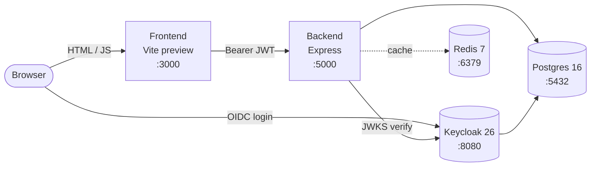

# Task Manager — Dockerized Secure Full-Stack App

A small team task manager with Keycloak authentication, owner-scoped data, Redis-cached analytics, PostgreSQL persistence, and a full Docker Compose setup.

**Candidate:** Sostene Ngarukiyimana

---

## Table of contents

1. [Project overview](#1-project-overview)
2. [Architecture](#2-architecture)
3. [Setup](#3-setup)
4. [Test user credentials](#4-test-user-credentials)
5. [Environment variables](#5-environment-variables)
6. [API documentation](#6-api-documentation)
7. [Dashboard and visualizations](#7-dashboard-and-visualizations)
8. [Redis usage](#8-redis-usage)
9. [Backup and restore](#9-backup-and-restore)
10.[Known limitations](#10-known-limitations)
11.[AI usage](#11-ai-usage)
12.[Repository structure](#12-repository-structure)

---

## 1. Project overview

An authenticated user can:

- Sign in and out through Keycloak.
- View their profile information (from the JWT).
- Create, view, update, and delete tasks (`todo` / `in_progress` / `done`, plus optional `priority` and `due_date`).
- See a dashboard with three analytics views (stat cards, tasks by status, tasks created over time).
- See only their own tasks and analytics — every backend query is scoped by the user's Keycloak `sub`.

### Stack

| Layer | Choice |
|---|---|
| Frontend | React 19 + TypeScript + Vite + Tailwind CSS v4 |
| Backend | Node.js 22 + Express 5 + TypeScript (ts-node) |
| Auth | Keycloak 26 (OIDC, RS256, JWKS) |
| Database | PostgreSQL 16 |
| Cache | Redis 7 |
| Charts | Recharts |
| Orchestration | Docker Compose (5 services on one bridge network) |

---

## 2. Architecture



All services share one Docker network. Named volumes give persistence: `taskmanager_postgres_data` (both the `taskmanager` and `keycloak` databases) and `taskmanager_redis_data` (append-only file). Full breakdown in [`docs/architecture.md`](./docs/architecture.md). Visual walkthrough in [`docs/screenshots/`](./docs/screenshots/).

---

## 3. Setup

### Prerequisites

- Docker Desktop (or Docker Engine + Compose v2)
- Git

You do not need Node, pnpm, Postgres, Redis, or Keycloak on your machine — everything runs in containers.

### Start

```bash
git clone <repo-url> sostene
cd sostene
cp .env.example .env
docker compose up --build
```

The first run takes a few minutes (image pulls + Keycloak realm import). The stack is ready when the logs show:

```text
backend     | Task Manager API running on http://localhost:5000 (development)
keycloak    | Imported realm task-manager
```

(Inside the container the backend binds to `0.0.0.0:5000` so Docker can forward host port `5001` to it. You reach it from your browser at `http://localhost:5001`.)

### URLs

| Service | URL |
|---|---|
| App | <http://localhost:3000> |
| Backend health | <http://localhost:5001/health> |
| Keycloak admin | <http://localhost:18080> |
| Postgres | `localhost:15432` |
| Redis | `localhost:6379` |

> The default `.env` uses raised host ports (`5001`, `15432`, `18080`) to avoid clashes with common local services. If you would rather use the standard ports (`5000`, `5432`, `8080`), edit `.env` — `.env.example` shows those values as the documented defaults.

### Keycloak admin console

URL <http://localhost:18080>, username `admin`, password `admin`. The relevant realm is `task-manager`; the frontend client is `taskmanager-frontend`. The two seeded test users (see next section) have stable UUIDs pinned in `keycloak/realm-export.json`, so they survive a `docker compose down -v`.

### Common commands

```bash
docker compose down              # stop, keep data
docker compose down -v           # stop, wipe all data
docker compose up -d --build     # rebuild after code changes
docker compose logs -f backend   # tail one service
docker compose ps                # see what is running
```

### Local development with hot reload

The frontend container serves a built bundle (no HMR). For iteration, run it on the host against the dockerized backend:

```bash
cd frontend && pnpm install && pnpm dev   # http://localhost:5173
```

---

## 4. Test user credentials

Two users are auto-imported by Keycloak on first boot. No manual realm or user setup is required.

| Email | Password | Realm roles | Keycloak UUID |
|---|---|---|---|
| `admin@example.com` | `admin` | `admin`, `user` | `00000000-0000-0000-0000-000000000001` |
| `user@example.com` | `password` | `user` | `00000000-0000-0000-0000-000000000002` |

The UUIDs are deliberately pinned in `keycloak/realm-export.json` so a backup taken at one point in time can still be restored after a full `docker compose down -v`. Without pinned IDs, Keycloak would generate a new random UUID per user on every realm import, and restored tasks would end up owned by a "ghost" user with no matching login.

The Keycloak superuser (for the admin console, not the app) is `admin` / `admin`, configurable via `KEYCLOAK_ADMIN` and `KEYCLOAK_ADMIN_PASSWORD` in `.env`.

---

## 5. Environment variables

Every variable is documented in `.env.example`. The defaults in that file are intentional local-dev values, committed so reviewers can run the project without guessing. Rotate every password before any non-local use.

| Variable | Used by | Purpose |
|---|---|---|
| `NODE_ENV` | backend | `development` or `production` |
| `FRONTEND_PORT` | compose | Host port for the frontend container |
| `BACKEND_PORT` | compose | Host port for the backend container |
| `POSTGRES_PORT` | compose | Host port for Postgres |
| `REDIS_PORT` | compose | Host port for Redis |
| `KEYCLOAK_PORT` | compose | Host port for Keycloak |
| `POSTGRES_USER` | backend, keycloak, scripts | DB role used by both the app and Keycloak |
| `POSTGRES_PASSWORD` | backend, keycloak | DB role password |
| `POSTGRES_DB` | backend | Application database name |
| `KEYCLOAK_DB` | postgres init | Keycloak's own database (separate from the app's) |
| `REDIS_PASSWORD` | backend, redis | Redis `requirepass` |
| `KEYCLOAK_ADMIN` | keycloak | Bootstrap admin username for the Keycloak console |
| `KEYCLOAK_ADMIN_PASSWORD` | keycloak | Bootstrap admin password |
| `KEYCLOAK_PUBLIC_URL` | backend (issuer validation), keycloak (`KC_HOSTNAME`) | The URL the browser sees; baked into the JWT `iss` claim |
| `KEYCLOAK_REALM` | backend | Realm name; must match `realm-export.json` |
| `VITE_API_BASE_URL` | frontend build | Backend URL the SPA calls |
| `VITE_KEYCLOAK_URL` | frontend build | Public Keycloak URL |
| `VITE_KEYCLOAK_REALM` | frontend build | Same realm name |
| `VITE_KEYCLOAK_CLIENT_ID` | frontend build | Frontend (public) client ID |

> `VITE_*` variables are baked into the frontend bundle at build time. After changing one in `.env`, run `docker compose up -d --build frontend` — restarting alone is not enough.

---

## 6. API documentation

All `/api/*` endpoints require a Bearer JWT from Keycloak. Token verification uses `RS256`, the issuer is `${KEYCLOAK_PUBLIC_URL}/realms/${KEYCLOAK_REALM}`, and signing keys come from the JWKS endpoint (cached for 10 minutes).

### Health

| Method | Path | Auth | Description |
|---|---|---|---|
| GET | `/health` | none | `{ "status": "ok" }` |

### Current user

| Method | Path | Auth | Description |
|---|---|---|---|
| GET | `/api/me` | Bearer | Returns `{ id, email, name }` from the token |

### Tasks

All task endpoints are owner-scoped (`owner_id = req.user.id`). A task that does not exist *or* belongs to another user returns **404** — existence is never leaked.

| Method | Path | Body | Description |
|---|---|---|---|
| GET | `/api/tasks` | — | List your tasks, newest first |
| POST | `/api/tasks` | `{ title*, description?, status?, priority?, due_date? }` | Create. Returns 201. |
| GET | `/api/tasks/:id` | — | Get one |
| PUT | `/api/tasks/:id` | partial of the above | Update |
| DELETE | `/api/tasks/:id` | — | Delete, returns 204 |

Validation rules:

- `title` — required, 1–255 characters
- `status` — one of `todo`, `in_progress`, `done`
- `priority` — one of `low`, `medium`, `high`
- `due_date` / `completed_at` — ISO 8601 string or `null`

### Analytics

All scoped to the authenticated user. All Redis-cached with a 30-second TTL.

| Method | Path | Description |
|---|---|---|
| GET | `/api/analytics/summary` | `{ total, todo, in_progress, done, completion_percentage }` |
| GET | `/api/analytics/tasks-by-status` | `[{ status, count }]`, always returns all three statuses |
| GET | `/api/analytics/tasks-created-over-time?days=30` | `[{ date, count }]` for the last N days (default 30, max 365). Zero-count days are filled in. |

### Example: list your tasks with curl

```bash
TOKEN=$(curl -s -X POST \
  -d "client_id=taskmanager-frontend" \
  -d "username=user@example.com" \
  -d "password=password" \
  -d "grant_type=password" \
  http://localhost:18080/realms/task-manager/protocol/openid-connect/token | jq -r .access_token)

curl -H "Authorization: Bearer $TOKEN" http://localhost:5001/api/tasks
```

---

## 7. Dashboard and visualizations

The `/dashboard` page renders three sections, each loaded independently so a failure in one does not blank the page:

1. **Stat cards** — Total tasks, Completed, In progress, Completion %.
2. **Tasks by status** — pie chart with color-coded slices (`todo` / `in_progress` / `done`).
3. **Tasks created over the last 30 days** — area chart with a gapless time series (zero-count days are included so the line never breaks).

All numbers come from real `tasks` rows aggregated server-side and filtered by `owner_id`. A request from user A would never include user B's rows.

---

## 8. Redis usage

### What Redis is used for

Read-through cache in front of the three analytics endpoints. Task CRUD is **not** cached (writes flow straight to Postgres).

| Endpoint | Cache key | TTL |
|---|---|---|
| `GET /api/analytics/summary` | `analytics:summary:<ownerId>` | 30s |
| `GET /api/analytics/tasks-by-status` | `analytics:status:<ownerId>` | 30s |
| `GET /api/analytics/tasks-created-over-time` | `analytics:timeline:<ownerId>:<days>` | 30s |

### Why Redis is useful here

Analytics queries aggregate over the entire `tasks` table per user. On the dashboard, those three queries fire on every page load and every section refresh. Caching them for 30 seconds collapses repeated visits and tab switches into a single Postgres round-trip, while still being short enough that any task creation, update, or deletion is reflected immediately (see invalidation below).

### Invalidation

On every successful `createTask` / `updateTask` / `deleteTask`, the backend runs `SCAN MATCH analytics:*:<ownerId>*` and `DEL`s every matching key. The next dashboard refresh produces a `MISS` and recomputes.

### Graceful degradation

The cache wrapper in `backend/src/utils/cache.ts` is fully `try/catch`-ed. If Redis is down or unreachable, the cache layer logs a warning and the request transparently falls through to Postgres. The API stays online.

### How to verify Redis is being used

```bash
docker compose logs -f backend | grep '\[cache\]'    # HIT / MISS / invalidated lines
docker compose exec redis redis-cli -a "$REDIS_PASSWORD" KEYS 'analytics:*'
docker compose exec redis redis-cli -a "$REDIS_PASSWORD" MONITOR   # live command stream
```

Implementation files:

- `backend/src/config/redis.ts` — singleton client with lazy connect and non-fatal error events.
- `backend/src/utils/cache.ts` — `cached(key, ttl, fn)` and `invalidatePattern(pattern)`.
- `backend/src/services/analyticsService.ts` — wraps each function in `cached(...)`.
- `backend/src/services/tasksService.ts` — invalidates after every successful write.

---

## 9. Backup and restore

Two scripts in `scripts/` wrap `pg_dump` and `psql` against the running Postgres container. Both read `POSTGRES_USER` and `POSTGRES_DB` from `.env`. The stack must be running.

### Backup

```bash
./scripts/backup-db.sh
```

Output:

```text
backups/task-manager-2026-05-31-114701.sql
```

### Restore

```bash
./scripts/restore-db.sh backups/task-manager-2026-05-31-114701.sql
```

Type `yes` at the prompt to confirm. The script uses `pg_dump --clean --if-exists`, so the restore drops and recreates each object cleanly.

### Verifying the cycle survives a full reset

Because Keycloak user UUIDs are pinned in `realm-export.json`, the following sequence works end-to-end:

1. Create a few tasks in the UI.
2. `./scripts/backup-db.sh`
3. `docker compose down -v && docker compose up -d --build`
4. Sign in again — the task list is empty.
5. `./scripts/restore-db.sh backups/<filename>.sql`
6. Refresh the page — tasks reappear, owned by the same admin user as before.

### Equivalent one-liners (no scripts needed)

```bash
# backup
mkdir -p backups && docker compose exec -T postgres \
  pg_dump -U "$POSTGRES_USER" "$POSTGRES_DB" --clean --if-exists \
  > "backups/task-manager-$(date +%Y-%m-%d-%H%M%S).sql"

# restore
docker compose exec -T postgres \
  psql -U "$POSTGRES_USER" -d "$POSTGRES_DB" \
  < backups/task-manager-<timestamp>.sql
```

---

## 10. Known limitations

| Limitation | Impact | How I would fix it |
|---|---|---|
| **CORS is wide open** (`app.use(cors())`) | Any origin can hit the API once it has a valid token. | Restrict to `process.env.CORS_ORIGIN` (the frontend URL). |
| **No `schema_migrations` tracking table.** Migrations re-run on every boot, only idempotent because of `IF NOT EXISTS` and DO-block guards. | Adding a future migration that depends on data introduced by an earlier one is risky. | Add a `schema_migrations` table and record each successfully applied file. |
| **No automated tests, no CI.** | Bonus rubric points missed. | Vitest + supertest for backend endpoint tests; a GitHub Actions workflow that runs `tsc --noEmit` for both packages on every PR. The most important test is the owner-scoping rule: user A cannot read, update, or delete user B's tasks (must return 404, not 403, to avoid leaking existence). |
| **No Swagger/OpenAPI docs.** | Bonus rubric points missed. | `swagger-jsdoc` + `swagger-ui-express` would expose `/api/docs` derived from the existing route handlers. |
| **No backend or Keycloak healthchecks in compose.** Postgres and Redis already have them. | Compose cannot gate the frontend on backend readiness, only on backend `started`. | Add a `healthcheck` block hitting `GET /health` for the backend and `/health/ready` for Keycloak. |
| **The `admin` role is defined but not enforced.** | All authenticated users have the same access. | Read realm roles from `realm_access.roles` in the JWT, expose a `requireRole('admin')` middleware, gate an admin-only `/api/admin/*` namespace. |
| **No `pgadmin` service (rubric-optional).** | Browsing the database from a UI requires `docker compose exec postgres psql ...`. | Add a `pgadmin/pgadmin4` service to `docker-compose.yml`. |

---

## 11. AI usage

See [`AI_USAGE.md`](./AI_USAGE.md) for the full disclosure: which tool was used, sample prompts, what was accepted, what was rejected or modified, and the security and correctness checks performed personally.

---

## 12. Repository structure

```text
sostene/
├── README.md                       # this file
├── AI_USAGE.md                     # AI disclosure
├── docker-compose.yml
├── .env.example
├── backend/
│   ├── Dockerfile
│   ├── package.json
│   ├── tsconfig.json
│   ├── migrations/
│   │   └── 001_init.sql
│   └── src/
│       ├── app.ts                  # express app (helmet, cors, json)
│       ├── index.ts                # bootstrap: migrations → redis → listen
│       ├── config/                 # constants, db pool, redis client
│       ├── controllers/            # tasks, analytics
│       ├── middlewares/            # auth (JWT/JWKS), error and 404 handlers
│       ├── routes/                 # me, tasks, analytics
│       ├── services/               # tasksService, analyticsService
│       ├── types/                  # express.d.ts (Request.user augmentation)
│       └── utils/
│           └── cache.ts            # cached() + invalidatePattern()
├── frontend/
│   ├── Dockerfile
│   ├── package.json
│   ├── vite.config.ts
│   ├── public/
│   │   └── silent-check-sso.html   # Keycloak silent SSO helper
│   └── src/
│       ├── App.tsx
│       ├── main.tsx
│       ├── config.ts
│       ├── keycloak.ts
│       ├── index.css
│       ├── api/                    # client.ts + types.ts
│       ├── components/             # NavBar, TaskCard, TaskForm
│       ├── hooks/
│       │   └── useTasks.ts
│       ├── lib/                    # errors.ts, taskLabels.ts
│       └── pages/                  # LandingPage, TasksPage, DashboardPage
├── keycloak/
│   └── realm-export.json           # auto-imported on first Keycloak boot
├── postgres/
│   └── init/
│       └── 01-create-keycloak-db.sql
├── scripts/
│   ├── backup-db.sh
│   └── restore-db.sh
└── docs/
    ├── architecture.md
    └── screenshots/
        ├── README.md
        ├── 01-landing.png
        ├── 02-login.png
        ├── 03-tasks-empty.png
        ├── 04-task-form.png
        ├── 05-tasks-board.png
        ├── 06-dashboard.png
        └── 07-keycloak-admin.png
```
