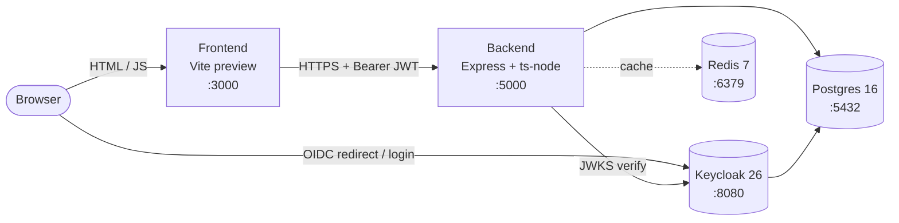

# Architecture

## High-level diagram

All services share one Docker bridge network (`taskmanager-network`). Named volumes give persistence:

| Volume | Purpose |
|---|---|
| `taskmanager_postgres_data` | App DB (`taskmanager`) **and** Keycloak DB (`keycloak`) — single Postgres instance, two logical databases |
| `taskmanager_redis_data` | Append-only file for cache survival |
| _(none for Keycloak)_ | Stateless; all state lives in Postgres |

## Services

### Frontend (`taskmanager-frontend`)

- **Stack:** React 19, TypeScript, Vite, Tailwind v4, `@react-keycloak/web`, Axios, Recharts.
- **Build:** single-stage Dockerfile. `pnpm install --frozen-lockfile` → `vite build` → `vite preview --host 0.0.0.0 --port 3000`. `VITE_*` args are baked in at build time.
- **Routing:**
  - `/` — public landing page
  - `/tasks` — kanban board (protected)
  - `/dashboard` — analytics (protected)
  - `*` — signed-in users go to `/tasks`, otherwise to `/`
- **Auth flow:** Keycloak adapter uses `onLoad: 'check-sso'` (no force-redirect on first paint). A `ProtectedPage` wrapper in `App.tsx` navigates to `/` on unauthenticated access; the landing page's *Get started* button calls `keycloak.login({ redirectUri })`, preserving the requested URL via `location.state`.

### Backend (`taskmanager-backend`)

- **Stack:** Express 5, TypeScript (ts-node), `pg`, `redis`, `jsonwebtoken`, `jwks-rsa`, `helmet`, `cors`.
- **Endpoints:**
  - `GET /health` — open
  - `GET /api/me` — protected; returns user info from JWT
  - `GET|POST|PUT|DELETE /api/tasks` — protected, owner-scoped CRUD
  - `GET /api/analytics/{summary,tasks-by-status,tasks-created-over-time}` — protected, owner-scoped, Redis-cached
- **Auth middleware (`src/middlewares/auth.ts`):**
  1. Extracts `Bearer` token from `Authorization` header.
  2. Fetches Keycloak JWKS (cached 10 min by `jwks-rsa`).
  3. Verifies with `jwt.verify` (`algorithms: ['RS256']`, `issuer: <KEYCLOAK_PUBLIC_URL>/realms/<KEYCLOAK_REALM>`).
  4. Attaches `req.user = { id: sub, email, name }`.
- **Issuer split:** the middleware verifies `iss` against `KEYCLOAK_PUBLIC_URL` (`http://localhost:18080`) but fetches JWKS from the internal `KEYCLOAK_URL` (`http://keycloak:8080`). Same realm, different network paths.
- **Migrations:** `src/index.ts` runs every `*.sql` in `backend/migrations/` (sorted) inside a transaction at startup. Idempotent via `IF NOT EXISTS` and DO-block enum guards.

### Postgres (`taskmanager-postgres`)

- **Image:** `postgres:16-alpine`.
- **Two databases:**
  - `taskmanager` — app data (`tasks` table).
  - `keycloak` — Keycloak's own data, created by `postgres/init/01-create-keycloak-db.sql` mounted into `/docker-entrypoint-initdb.d/`.
- **Healthcheck:** `pg_isready -U $POSTGRES_USER -d $POSTGRES_DB`. Backend and Keycloak both wait for `service_healthy`.

### Redis (`taskmanager-redis`)

- **Image:** `redis:7-alpine`.
- **Command:** `redis-server --requirepass <REDIS_PASSWORD> --appendonly yes`.
- **Role:** read-through cache for the three analytics endpoints. 30s TTL per key, scoped by `ownerId`. Invalidated on every task write.
- **Graceful degradation:** if Redis is unreachable, the cache wrapper falls through to Postgres. The API stays up.

### Keycloak (`taskmanager-keycloak`)

- **Image:** `quay.io/keycloak/keycloak:26.0`.
- **Command:** `start-dev --import-realm`. Dev mode (HTTP, no TLS) — local-only.
- **Realm:** `task-manager`, auto-imported from `./keycloak/realm-export.json` on first boot.
- **Seeded users:** `admin@example.com` / `admin` (roles `admin`, `user`); `user@example.com` / `password` (role `user`).
- **Frontend client:** `taskmanager-frontend` — public (no secret), PKCE S256, redirect URIs and web origins both `http://localhost:3000`.

## Data flow: a typical request

1. Signed-in user visits `/dashboard`.
2. `useEffect` in `DashboardPage` fires three GETs in parallel.
3. Axios request interceptor calls `keycloak.updateToken(30)` and sets `Authorization: Bearer <token>`.
4. Backend `authMiddleware` verifies the JWT against Keycloak's JWKS.
5. `analyticsService.getSummary(ownerId)` calls `cached('analytics:summary:<ownerId>', 30, () => sqlQuery())`.
6. Cache hit → JSON returned from Redis. Miss → Postgres query runs, result is cached, returned to user.
7. After a task write, `tasksService` calls `invalidatePattern('analytics:*:<ownerId>*')`. Next dashboard hit recomputes.

## Trust boundaries

- **Browser → Frontend:** untrusted. The frontend is static JS; Keycloak handles login.
- **Browser → Backend:** every request must carry a valid Keycloak JWT. The backend never trusts user-supplied IDs — every owner-scoped query uses `req.user.id` (the JWT `sub`).
- **Backend → Postgres / Redis / Keycloak:** internal Docker network only. Postgres and Redis ports are also published to the host for dev convenience; in a real deployment they would not be.

## Owner scoping

Every query against `tasks` includes `WHERE owner_id = $X` where `$X` is the JWT `sub`. No code path returns a task to anyone but its owner. Service functions return `null` for "not yours" so the API cannot be used to probe for the existence of other users' tasks.

## Out of scope

- **No RBAC enforcement.** The realm defines `admin` and `user` roles; the backend treats every authenticated user identically. Marked as bonus in the assignment.
- **No background workers / job queues.** Nothing async. Redis is only a cache.
- **No service mesh, no API gateway.** Single backend, direct calls.
- **No production hardening.** Dev-mode Keycloak, wide-open CORS, no TLS, plaintext passwords in `.env`. All explicitly local-dev.
